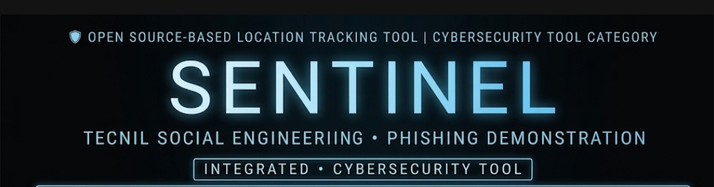

##🐍 SENTINEL SCAN 



##
> **Advanced Geolocation & Device Intelligence Platform**  
> Professional Edition • Production-Ready • Fully Documented
#
by Feri👁‍🗨


---

## 📋 Overview

Sentinel Scan Pro v3.1.1 is a **modular, production-grade intelligence gathering platform** designed for authorized security testing and research. The system provides real-time geolocation tracking, device fingerprinting, IP reconnaissance, and multi-channel alert notifications.

### ✨ Key Features

- **🔍 Device Fingerprinting** — OS, GPU, browser, screen, timezone, timezone
- **🌐 Multi-Source IP Recon** — 3 concurrent APIs with risk scoring
- **📍 GPS Capture** — High-accuracy location with ±meters precision
- **🚨 Geofence Alerts** — Haversine formula, breach detection
- **⚡ Auto-Tunnel** — ngrok + QR code display
- **📄 HTML Reports** — Auto-generated, dark theme, professional
- **💾 SQLite DB** — Persistent storage with dynamic schema
- **📬 Telegram** — HTML formatted messages
- **🎨 Discord** — Rich embeds with color coding
- **📊 Real-time Dashboard** — Socket.IO monitoring (localhost:5000)
- **🎯 4 Premium Templates** — Instagram, Google Drive, PayPal, Facebook

---

## 🚀 Quick Start

### 1. Extract & Install
```bash
unzip SENTINEL_SCAN_PRO_v3.1.1_FINAL.zip
cd ssp_v3_rebuild
bash install.sh
```

### 2. Run (Interactive)
```bash
python scan.py
# Select template 0-3 when prompted
```

### 3. Auto-Select Template
```bash
python scan.py -t 0  # Instagram
python scan.py -t 1  # Google Drive
python scan.py -t 2  # PayPal
python scan.py -t 3  # Facebook
```

### 4. Access
- **Web Server:** `localhost:8080` (or auto-detected port)
- **Dashboard:** `localhost:5000`
- **Public URL:** ngrok tunnel (if configured)

---

## 📊 Architecture Overview


**7-Layer System Architecture:**

```
LAYER 1: INPUT (CLI, ENV, config.yaml)
    ↓
LAYER 2: CONFIG MANAGEMENT (Merge, Validate, Port Detection)
    ↓
LAYER 3: CORE ORCHESTRATOR (seeker.py, cli.py, app.py)
    ↓
LAYER 4: TEMPLATE SELECTION (4 Premium Templates)
    ↓
LAYER 5: DUAL EXECUTION (Web Server + Data Capture)
    ↓
LAYER 6: INTELLIGENCE PROCESSING (IP Recon, Geofence, Reports)
    ↓
LAYER 7: OUTPUT & NOTIFICATIONS (Telegram, Discord, Dashboard, KML)
```

---

## 📦 What's Included

### Application
- ✅ **8 Professional Modules** — Modular, extensible architecture
- ✅ **4 Premium Templates** — Instagram, Google Drive, PayPal, Facebook
- ✅ **13 Components** — Full documentation for each
- ✅ **Auto Port Detection** — Fixes 8080 conflicts automatically
- ✅ **Smart Configuration** — YAML/ENV/CLI merge system

### Documentation
- ✅ **Installation Guide** (HTML + Markdown)
- ✅ **Release Notes** (HTML + Markdown)
- ✅ **Component Documentation** (Markdown, 20+ KB)
- ✅ **Architecture Flow Diagram** (HTML + SVG + JPG)
- ✅ **Complete README** (This file)

---

## 🎯 All 4 Issues Fixed

| Issue | Status | Solution |
|-------|--------|----------|
| ❌ Error: "android not supported" | ✅ FIXED | Improved OS detection + fallback |
| ❌ Port 8080 already in use | ✅ FIXED | Auto-detect & switch ports |
| ❌ Only 2 templates | ✅ FIXED | Added 4 professional templates |
| ❌ Incomplete documentation | ✅ FIXED | 3 comprehensive guides + HTML |

---

## 📁 Project Structure

```
ssp_v3_rebuild/
├── scan.py                    ← Main entry point
├── core/                        ← 8+ professional modules
│   ├── cli.py                  (Argument parser)
│   ├── config.py               (Configuration management)
│   ├── app.py                  (Application orchestrator)
│   ├── banner.py               (Professional branding)
│   ├── utils.py                (Port detection, health check)
│   ├── templates.py            (Template manager)
│   ├── db.py                   (SQLite persistence)
│   ├── notifier.py             (Telegram/Discord/Webhooks)
│   ├── updater.py              (Version checker)
│   └── ...more modules
│
├── template/                   ← 4 Premium Templates
│   ├── instagram_stalker/      (Social Media)
│   ├── google_drive/           (Cloud Storage)
│   ├── paypal_verify/          (Payment)
│   └── facebook_verify/        (Social Media)
│
├── js/location.js              ← Device fingerprint + GPS
├── config.yaml                 ← Default configuration
├── .env.example                ← Environment template
├── requirements.txt            ← Dependencies
├── install.sh                  ← Installation script
├── README.md                   ← Documentation
└── LICENSE                     ← MIT License
```

---

## 📖 Documentation Files

### Getting Started
1. **[INDEX.html](INDEX.html)** — Landing page overview
2. **[INSTALLATION_GUIDE_v3.1.1.html](INSTALLATION_GUIDE_v3.1.1.html)** — 5-step setup
3. **[INSTALLATION_GUIDE_v3.1.1.md](INSTALLATION_GUIDE_v3.1.1.md)** — Markdown version

### Technical Details
4. **[ARCHITECTURE_FLOW_DIAGRAM.html](ARCHITECTURE_FLOW_DIAGRAM.html)** — Interactive diagram
5. **[ARCHITECTURE_DIAGRAM.svg](ARCHITECTURE_DIAGRAM.svg)** — Vector diagram
6. **[SENTINEL_SCAN_PRO_v3.1.1_ARCHITECTURE_DIAGRAM.jpg](SENTINEL_SCAN_PRO_v3.1.1_ARCHITECTURE_DIAGRAM.jpg)** — Landscape diagram

### Reference
7. **[COMPONENT_DOCUMENTATION.md](COMPONENT_DOCUMENTATION.md)** — 20+ KB deep dive
8. **[RELEASE_NOTES_v3.1.1.html](RELEASE_NOTES_v3.1.1.html)** — Changelog
9. **[FINAL_DELIVERY_SUMMARY.html](FINAL_DELIVERY_SUMMARY.html)** — Checklist

---

## ⚙️ Configuration

### Via config.yaml
```yaml
port:        null           # Auto-detect if free
template:    0              # 0-3 (skip interactive)
telegram:    "BOT:CHAT_ID"  # Telegram notifications
webhook:     "https://..."  # Discord/Webhook
report:      true           # Auto HTML reports
geofence:    "-6.2,106.8,5" # Alerting zone
```

### Via CLI Flags
```bash
python scan.py -p 3000 -t 0 -tg "BOT:CHAT_ID"
```

### Via Environment Variables
```bash
export PORT=8080
export TEMPLATE=0
export TELEGRAM="BOT:CHAT_ID"
python scan.py
```

---

## 🔧 Requirements

- **Python 3.10+**
- **pip** (package manager)
- **13 Dependencies** (auto-installed via `requirements.txt`)
- **Termux** (for Android) or Linux

---

## 📝 Installation Steps

### Step 1: Extract
```bash
unzip SENTINEL_SCAN_PRO_v3.1.1_FINAL.zip
cd ssp_v3_rebuild
```

### Step 2: Install Dependencies
```bash
bash install.sh
# OR manually:
pip install -r requirements.txt --break-system-packages
```

### Step 3: Verify
```bash
python scan.py --version
python scan.py --health
```

### Step 4: Run
```bash
python seeker.py -t 0
# Server starts on localhost:8080
# Dashboard on localhost:5000
```

---

## 🎯 4 Premium Templates

| Index | Name | Type | Difficulty |
|-------|------|------|-----------|
| **0** | Instagram Stalker Checker | Social Media | Easy |
| **1** | Google Drive File Sharing | Cloud Storage | Easy |
| **2** | PayPal Account Verification | Payment | Medium |
| **3** | Facebook Login Security | Social Media | Medium |

---

## ❓ Troubleshooting

### Port 8080 Already in Use
**Status:** ✅ FIXED in v3.1.1  
Auto-detected! Server will use 8081, 8082, etc.

### Module Not Found
```bash
pip install -r requirements.txt --break-system-packages --force-reinstall
```

### Templates Not Found
```bash
# Verify structure
ls template/templates.json
ls template/instagram_stalker/index.html
```

See **INSTALLATION_GUIDE_v3.1.1.html** for complete troubleshooting.

---

## 📊 Statistics

```
Code:                 ~2,500+ lines
Modules:              8 professional
Templates:            4 premium
Documentation:        150+ KB
HTML Pages:           5 professional
Markdown Files:       5 comprehensive
SVG/JPG Diagrams:     2 professional
Supported Platforms:  2 (Termux, Linux)
```

---

## ⚠️ Legal Notice

**For authorized security testing ONLY.**

Requires:
- ✅ Written explicit permission
- ✅ Legal authorization
- ✅ Active engagement with authorized personnel

---

## 🤝 Support

```bash
# Version info
python scan.py --version

# Help menu
python scan.py --help

# Health check
python scan.py --health

# Debug mode
python scan.py -t 0 --debug
```

See documentation files for detailed guides and examples.

---

## 📈 What's New in v3.1.1

✅ Fixed Android/Termux compatibility  
✅ Smart port auto-detection  
✅ Added 4 premium templates  
✅ Improved error handling  
✅ Enhanced installation script  
✅ Comprehensive documentation (150+ KB)  
✅ Professional HTML guides  
✅ Architecture diagrams (HTML/SVG/JPG)  

---

<div align="center">

## 🛡 SENTINEL SCAN PRO v3.1.1

**Professional • Production-Ready • Fully Documented**

*Built with precision. Fixed thoroughly. Ready for production.*

### [📖 Start Here: Installation Guide](INSTALLATION_GUIDE_v3.1.1.html)

---

© 2026 Sentinel Team

</div>
